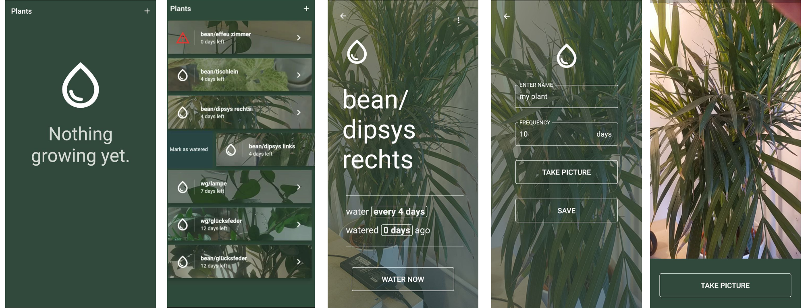

# Water Me 🪴

> A simple, open and privacy friendly plant watering reminder for Android.
  
  [](https://github.com/abertschi/water-me/actions/workflows/build.yml)
   
<p align="left">
    
</p>

_Water me_ is a mobile application written in Flutter to  remind you to water your plants. No ads, no account, no sign-up, no tracking.

### Features and Components
- Add plants with watering frequency, name and picture
- No remote entity, local-only application
- Flutter, currently support for Android
- Camera access
- Local Notifications
- Workmanager with periodic task
- Provider package for MVC separation
  
### Install
_Water Me_ is available on the [F-droid store](https://f-droid.org/packages/ch.abertschi.waterme.water_me) [(Metadata)](https://gitlab.com/fdroid/fdroiddata/-/blob/master/metadata/ch.abertschi.waterme.water_me.yml).

[](https://f-droid.org/packages/ch.abertschi.waterme.water_me)

Alternatively, download released versions from the [release section](https://github.com/abertschi/water-me/releases) of this repository or the [continuous integration action](https://github.com/abertschi/water-me/actions/workflows/build.yml) for builds of the latest commits (requires a Github account).


### Build
This is a flutter based Android application. Ensure to have Android-Studio and flutter-sdk installed.
```
flutter pub get
flutter build apk
```

The entire build process in captured in [scripts/build.sh](https://github.com/abertschi/water-me/blob/master/scripts/build.sh).
 
### Feature and Contribution Ideas
Pull requests are welcome :heart:.

- [ ] A better logo :) [#4](https://github.com/abertschi/water-me/issues/4)
- [ ] Enable 'web' target to build a web app for ios/ web (needs a backend for notifications).
- [ ] Integrate firebase/ self hosted backend to enable a group mode to sync plant state within a group of users
- [ ] Add a 'note' field to a plant
- [ ] Show watering history in plant detail screen.
- [ ] Allow assignment of plants into groups, e.g. living room, office

And [more ideas](https://github.com/abertschi/water-me/issues).

### License
GPL v3

### About
Built with <3   
by Andrin Bertschi  
https://abertschi.ch
