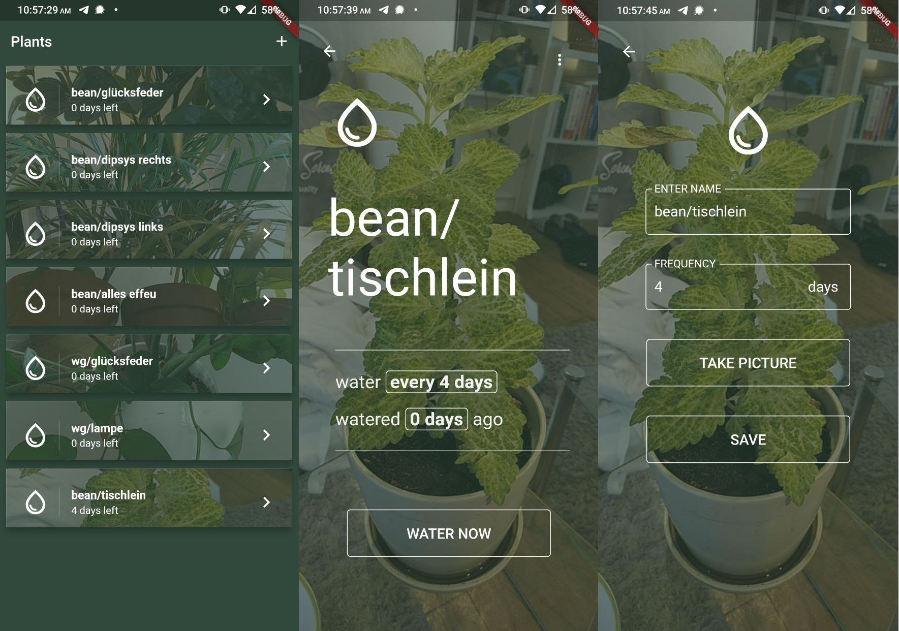

# Water Me 🪴

> A simple and open plant watering reminder for Android.
  

    

_Water me_ is a mobile application written in Flutter to  remind you to water your plants.

### Features and Components
- Add plants with watering frequency, name and picture
- Writter in Flutter
- (Currently) Support for Android
- Camera access
- Local Notifications
- Workmanager with periodic task
- Flutter Provider package for MVC separation

Work in progress. Pull requests are welcome.

